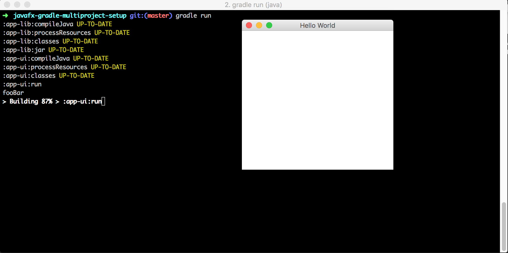

# javafx-gradle-multiproject-setup

#### Justification of this sample project

  I created this base project, because after trying to find good solutions of having a simple JavaFx project with a library module based on gradle, it was really hard to do it and they samples didn't work correctly. However, use the following links for a complete plug-in to use JavaFX:

  For a no longer supported but more mature project you can check this javafx-gradle plug-in:

https://bitbucket.org/shemnon/javafx-gradle/

  For a promising one but still unstable, you should definitely check this project:

https://github.com/FibreFoX/javafx-gradle-plugin

## How to use it:

It's very simple since I'm using the standard gradle java and application plug-in, just run:

    gradle run
    

You should see your JavaFX app running:

I added a Unit Test example on the lib module, you can execute unit tests by running:

    gradle test

For more details on other tasks please check the gradle dsl:
https://docs.gradle.org/current/dsl/

